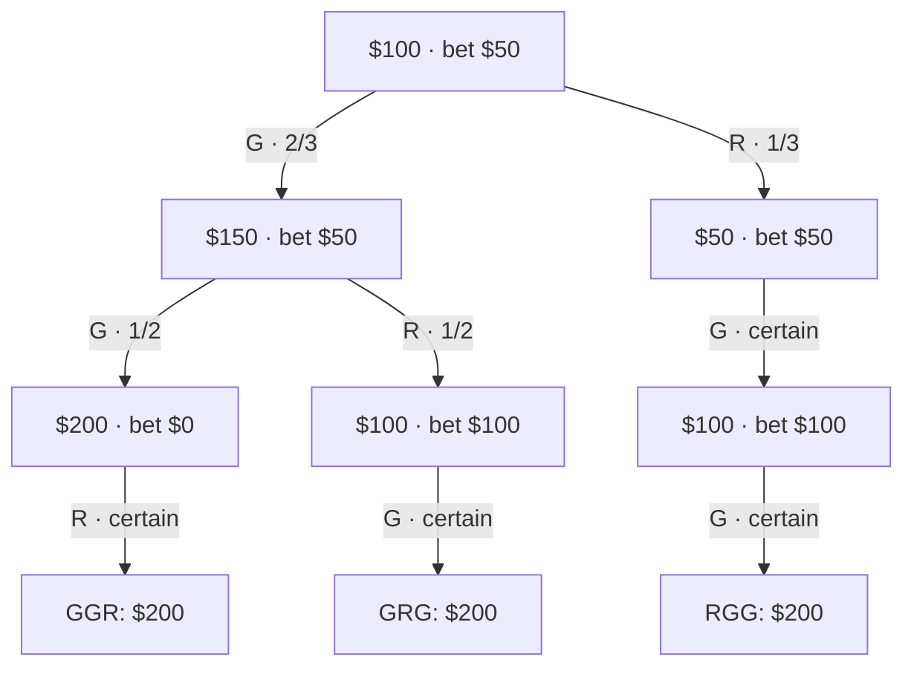

import PikurnExplorer from './PikurnExplorer.astro'
import WagerLab from './WagerLab.astro'
import DecisionGeometry from './DecisionGeometry.astro'
import { Code } from 'astro-expressive-code/components'
import solverSource from './pikurn.ts?raw'
import './pikurn-article.css'

<div class='pikurn-article'>

Start with **\$100** and a uniformly shuffled bag of **two green balls and one red ball**.

- Before each draw, bet any amount of your current bankroll on green.
- Green adds your stake; red subtracts it.
- Draw without replacement. You see the ball even if you bet nothing.

The best first bet depends on the objective:

$$
\begin{aligned}
\max\;\mathbb E[W]&:\quad\text{bet }0,\qquad\mathbb E[W]=\tfrac{700}{3}.\\
\max\;\min W&:\quad\text{bet }50,\qquad W=200\text{ on every runout}.
\end{aligned}
$$

Here $W$ is **final bankroll**, including the starting \$100. Austin Henley posed the original puzzle during a conversation at [Khaki AI](https://khaki.email/). The distinction between those two objectives is what makes it interesting.

## Explore the game

Choose an objective, then a possible draw. The wager updates after each observation. Blue balls are optional: drawing one returns the stake and ends the game.

<PikurnExplorer />

Three useful comparisons:

- **Original bag, three draws:** maximum average \$233⅓; maximum guarantee \$200.
- **Same bag, one draw:** maximizing the average means going all-in.
- **Three greens, one red, one blue, five draws:** go all-in for the best average, but no policy can guarantee a profit—blue might appear first.

## Maximum average

The original bag has three equally likely runouts:

$$
P(RGG)=P(GRG)=P(GGR)=\tfrac13.
$$

Wait until the red appears, then go all-in on each remaining green:

| Runout | Bankroll after each draw | Finish |
| --- | --- | --- |
| `RGG` | 100 → 200 → 400 | \$400 |
| `GRG` | 100 → 100 → 200 | \$200 |
| `GGR` | 100 → 100 → 100 | \$100 |

The average is $(400+200+100)/3=700/3$. Why pass up a ⅔ chance of green? A dollar lost on an early red would otherwise be doubled twice. **The value of a bet includes its effect on future wagers.**

To prove optimality, keep both uncertain decisions in the calculation. Let $X$ be the first dollar bet and $Y$ the dollar bet after a first green:

$$
0\le X\le100,\qquad 0\le Y\le100+X.
$$

All other decisions have known colors: bet everything on green and nothing on red. These choices weakly improve every ending, so they lose no optimum.

$$
\begin{aligned}
W_{RGG}&=4(100-X),\\
W_{GRG}&=2(100+X-Y),\\
W_{GGR}&=100+X+Y.
\end{aligned}
$$

Hence

$$
\mathbb E[W]=\frac{700-X-Y}{3}\le\frac{700}{3},
$$

with equality at **$X=Y=0$**. Even the 50–50 second bet reduces the whole game's expectation: losing there removes money that could double on the final green.

<WagerLab />

## Maximum guarantee

Set **$X=Y=50$**. The second bet is one-third of the \$150 bankroll after a green. Every branch ends at \$200:



A higher guarantee is impossible. Requiring all three endings to be at least $m$ gives

$$
\begin{aligned}
RGG:&\quad X\le100-\tfrac m4,\\
GRG,\;GGR:&\quad X\ge\tfrac{3m}{4}-100.
\end{aligned}
\qquad\Longrightarrow\qquad m\le200.
$$

The first-bet-only strategy ($Y=0$) peaks at a guarantee of \$160. Adapting the second bet raises it to \$200.

## The average–guarantee frontier

Suppose a ticket home costs \$150. You can guarantee it with $X=Y=25$: the endings are \$300, \$200, and \$150, averaging \$216⅔.

More generally, for a floor $100\le m\le200$,

$$
\boxed{\max_{W\ge m}\mathbb E[W]=\frac{800-m}{3}},
\qquad X=Y=\frac{m-100}{2}.
$$

**Each extra dollar of guarantee costs one-third of a dollar in average bankroll.**

| Goal | $X$ | $Y$ | Guarantee | Average |
| --- | --- | --- | --- | --- |
| Maximum average | 0 | 0 | \$100 | \$233⅓ |
| \$150 ticket | 25 | 25 | \$150 | \$216⅔ |
| Maximum guarantee | 50 | 50 | \$200 | \$200 |

<details class='pikurn-proof'>
<summary>Deriving the frontier</summary>

The `GGR` constraint gives $X+Y\ge m-100$, so $\mathbb E[W]\le(800-m)/3$. Choosing $X=Y=(m-100)/2$ produces endings $600-2m$, $200$, and $m$. For $m\in[100,200]$, their minimum is $m$: the upper bound is attained.

</details>

The rules permit arbitrarily divisible stakes, with no fees or borrowing. Rounding bets to cents changes the optimization problem. Maximizing the *probability* of reaching a target is also a separate objective.

## General bags: the Bellman equations

Use state $s=(g,r,b,n)$: remaining greens, reds, blues, and draws. Write $T=g+r+b$ and wager a fraction $f\in[0,1]$ of bankroll $D$.

$$
(D,s)\longrightarrow
\begin{cases}
\bigl(D(1+f),\;(g-1,r,b,n-1)\bigr)&\text{with probability }g/T,\\
\bigl(D(1-f),\;(g,r-1,b,n-1)\bigr)&\text{with probability }r/T,\\
D\quad\text{(stop)}&\text{with probability }b/T.
\end{cases}
$$

Wealth scales linearly, so memoize only the count state. Let $E(s)$ and $H(s)$ be optimal expected and guaranteed wealth **per starting dollar**. Both equal 1 when $n=0$ or the bag is empty. Subscripts $G,R$ denote continuation values after the corresponding draw.

### Expected wealth

$$
E(s)=\max_{0\le f\le1}\frac{g(1+f)E_G+r(1-f)E_R+b}{T}.
$$

This is affine in $f$. Its slope determines the wager:

$$
f_E^*=\begin{cases}
1&gE_G>rE_R,\\
0&gE_G<rE_R,\\
\text{any }f\in[0,1]&gE_G=rE_R.
\end{cases}
$$

The implementation chooses zero on ties. Blue contributes current wealth and terminates; it has no continuation value.

### Guaranteed wealth

$$
H(s)=\max_{0\le f\le1}\min\bigl\{
(1+f)H_G,\;(1-f)H_R,\;1\text{ if }b>0
\bigr\}.
$$

Omit absent colors. The optimum lies at an endpoint or an intersection of branch lines. With both green and red present, their equalizing candidate is

$$
f_H=\frac{H_R-H_G}{H_R+H_G},
$$

when this lies in $[0,1]$. For one green, one red, and two draws, $H_G=1$ and $H_R=2$:

$$
E(f)=\tfrac32-\tfrac f2,
\qquad H(f)=\min\{1+f,\;2-2f\}.
$$

<DecisionGeometry />

The mean decreases from the outset; the guarantee peaks at $f=1/3$. If any blue remains, an immediate stop caps the guarantee at **1**, attained by betting zero throughout.

## Closed forms

### Full bag, no blue: maximum average

For $N=g+r$,

$$
E(g,r,0,N)=\frac{\sum_{k=0}^{g}\binom Nk}{\binom Ng}.
$$

**Wait for the last red, then go all-in on every green.** This policy is optimal for any complete bag without blue; it need not be optimal with a shorter horizon or blue stops.

<details class='pikurn-proof'>
<summary>Proof by induction</summary>

Substitution into the wager coefficient, using Pascal's identity, gives for $g,r>0$

$$
gE(g-1,r)-rE(g,r-1)=-r<0.
$$

Thus zero is optimal while a red remains. The zero-bet recurrence agrees with the formula, as do the boundaries $E(0,r)=1$ and $E(g,0)=2^g$. Induction proves the result.

</details>

### Limited horizon, no blue: maximum guarantee

For $0\le n\le g+r$, define $S(n,r)=\sum_{k=0}^{\min(r,n)}\binom nk$. Then

$$
H(g,r,0,n)=\frac{2^n}{S(n,r)},
\qquad f_H^*=\frac{\binom{n-1}{r}}{S(n,r)}\quad(n>0).
$$

Out-of-range binomial coefficients are zero. The original game has $S(3,1)=4$, giving $H=2$ and $f_H^*=1/2$.

The number of greens disappears once the horizon is feasible. Extra greens improve probabilities but leave the worst feasible sequences unchanged when $n,r$ stay fixed.

<details class='pikurn-proof'>
<summary>Proof via the reciprocal recurrence</summary>

If $r\ge n$, an all-red prefix is possible and $H=1$. If $r=0$, all draws are green and $H=2^n$. Otherwise both colors exist. Inductively, their continuation guarantees $A,C$ satisfy $A\le C$. Equalizing the branches gives

$$
H=\frac{2AC}{A+C},
\qquad \frac1H=\frac12\left(\frac1A+\frac1C\right).
$$

Pascal's identity gives $S(n,r)=S(n-1,r)+S(n-1,r-1)$, completing the induction. Substitution into $(C-A)/(C+A)$ gives the stated wager fraction.

</details>

## Code and checks

[Download pikurn.ts](./pikurn.ts) and run it with Node.js 24.2 or newer:

```sh
node pikurn.ts
```

No dependencies or build step. It prints both policies and every runout. For a custom bag:

```ts
import { solve, enumerate } from './pikurn.ts'

const state = { g: 3, r: 1, b: 1, n: 5 }
console.log(solve(state, 'expected')) // value: 1.9; fraction: 1
console.table(enumerate(state, s => solve(s, 'expected').fraction, 100))
```

<details class='pikurn-source'>
<summary>Read the complete solver and command-line program</summary>
<Code code={solverSource} lang='ts' title='pikurn.ts' />
</details>

The listing and explorer import the same file. The ZIP below includes all visualization code and editable figures.

- **Solver:** memoized count states; at most $(g+1)(r+1)(b+1)(n+1)$ combinations, with constant work per state.
- **Explorer:** exhaustive runouts for bags up to eight balls; displayed trees stop after three draws. Enumeration can grow exponentially.
- **Verification:** independent action-grid recursion, probability conservation, bankroll scaling, and comparisons with both closed forms.

The code uses floating-point arithmetic with a small tie tolerance and rejects numerical overflow. The derivations establish the exact results; large computations remain limited by memory, recursion depth, and number range.

<p class='pikurn-note'>
Background: Bellman's <a href='https://pmc.ncbi.nlm.nih.gov/articles/PMC1063639/'>On the Theory of Dynamic Programming</a> and Auckland's <a href='https://www.stat.auckland.ac.nz/~fewster/210/notes/2017S2/ch3blank.pdf'>sampling-without-replacement notes</a>. The Pikurn formulas are derived above. Thanks to <a href='https://austinhenley.com/'>Austin Henley</a>, <a href='https://g.regory.dev/'>Gregory Croisdale</a>, and <a href='https://unhexium.net/'>Ben Klein</a> for the original discussion.
</p>

</div>
