Recently I visited the the folks behind the startup [Khaki AI](https://khaki.email/), and our conversation veered into mathematical brain teasers.

* ["Greg" Gregory Croisdale](https://g.regory.dev/)
* ["Robo" Ben Klein](https://unhexium.net/)
* ["AZH" Austin Henley](https://austinhenley.com/blog/techstarsdiary.html)
* ["Me" Cade Brown](https://cade.io)


## Initial Problem Statement

Specifically, my old boss AZH posed an interesting problem:

> You are offered to play a game, which will consist of 3 coin flips.
>
> However, the coin flips are not fair and independent: you are told that there will be exactly 2 heads, and 1 tails.
>
> You start with $100, and you can choose to bet any amount on each flip. You win when the result is a heads flip, and lose when it is a tails flip.
>
> The payout is double-or-nothing: if you win, you net your bet amount, and if you lose, you lose your bet amount.
>
> Q: What is the optimal strategy to maximize your expected winnings?

As for the source of the problem? A fusion of the core trick in the [Monty Hall Problem](https://en.wikipedia.org/wiki/Monty_Hall_problem) (each outcome 'reveals' new information about the remaining outcomes), game-theory-ification, and of course, meandering shower thoughts:


## Restating and Generalizing the Problem

While the original statement is interesting and is great as a simple brain teaser or interview question, it makes sense to make a few modifications:

* Since the events are not independent, they aren't really 'coin flips'
  * Instead, let's consider events as picking balls from a ['bag' (aka multiset)](https://en.wikipedia.org/wiki/Multiset), without replacement
* To generalize further than $N=3$, let's consider a game with an arbitrary number of wins/losses guaranteed, encoded as the number of green and red balls in the bag
* Let's also consider a third possible outcome, in which the game terminates immediately
  * For basic analysis, we will consider 0 of these outcomes (equivalent to the problem without termination)
  * Further on, we'll see that this can affect the optimal strategy


With these modifications, here is the generalized problem statement we will be using for the rest of this post:

> You are offered to play a game, in which you start out with a bankroll of $D$ dollars.
>
> At the beginning, there is a 'bag' of colored balls, with $G$ green balls (🟢), $R$ red balls (🔴), and $B$ blue balls (🔵).
>
> The game will consist of up to $N$ events, in which a random ball is picked from the bag.
>
> Before each event, you can choose to wager any amount (from 0 to your current bankroll) on the event:
>
> * If the ball is GREEN, you 'win' and receive double your wager back (i.e. bet 1$, win 2$)
> * If the ball is RED, you 'lose' and lose your wager from your bankroll
> * If the ball is BLUE, the game ends immediately, and you receive your wager back
>
> At the end of the game, you cash out your remaining bankroll.

Let's name this game $Game(D, N, G, R, B)$. Thus, our original problem corresponds to $Game(100, 3, 2, 1, 0)$.

In addition, let's define a few additional terms:

* $S$ is a given 'strategy' for playing the game, expressible as some algorithm of function for predicting moves
* $E_S[Game(D, N, G, R, B)]$ is the [expected value](https://en.wikipedia.org/wiki/Expected_value) of the game (i.e. the ending bankroll you will have on average)
* $Min_S[Game(...)]$ is the minimum possible ending bankroll you can have (i.e. the worst-case scenario)
* $Max_S[Game(...)]$ is the maximum possible ending bankroll you can have (i.e. the best-case scenario)

NOTE: If the $_S$ subscript is ommitted, it is implied to be the GTO (Game Theory Optimal) strategy, which may not be derived yet.

We can make a "game-tree" diagram to visualize the possible paths of the game, where each node is a state of the game, and each edge is a probablistic transition to the next state:

```mermaid
---
config:
  padding: 10
---

graph TD
    A[Start<br>🔴🟢🟢] -->|G=2/3| A_G
    A -->|R=1/3| A_R
    
    A_G[🔴🟢] -->|G=1/2| A_G_G
    A_G -->|R=1/2| A_G_R

    A_R[🟢🟢] -->|G=2/2| A_R_G

    A_G_G[🔴] -->|R=1/1| A_G_G_R

    A_G_R[🟢] -->|G=1/1| A_G_R_G

    A_R_G[🟢] -->|G=1/1| A_R_G_G

    A_G_G_R[∅]
    A_G_R_G[∅]
    A_R_G_G[∅]

```



We can simplify this diagram my merging nodes that are equivalent (i.e. have the same number of green and red balls). This creates a directed acyclic graph (DAG) of the game:

```mermaid
graph TD
    A_2G_1R[Start<br>🔴🟢🟢] -->|G=2/3| A_1G_1R
    A_2G_1R -->|R=1/3| A_2G_0R
    
    A_1G_1R[🔴🟢] -->|G=1/2| A_0G_1R
    A_1G_1R -->|R=1/2| A_1G_0R

    A_2G_0R[🟢🟢] -->|G=2/2| A_1G_0R

    A_0G_1R[🔴] -->|R=1/1| A_0G_0R

    A_1G_0R[🟢] -->|G=1/1| A_0G_0R

    A_0G_0R[∅]

```



In addition, if we prune the nodes that have no choices (i.e. a single transition edge, or a terminal node), we can see a DAG that only focuses on "important" nodes that we have a "real" decision to make:

```mermaid
graph TD
    A_2G_1R[Start<br>🔴🟢🟢] -->|G=2/3| A_1G_1R
    A_2G_1R -->|R=1/3| A_2G_0R
    
    A_1G_1R[🔴🟢] -->|G=1/2| A_0G_1R
    A_1G_1R -->|R=1/2| A_1G_0R

    A_2G_0R[🟢🟢]

    A_0G_1R[🔴]

    A_1G_0R[🟢]


```




## Basic Analysis and Strategies

So, let's first consider ourselves as a human playing this game. How do we approach it?

For this section, we are using the 'simple' version, i.e. $Game(100, 3, 2, 1, 0)$ which has a bag of 🟢🟢🔴.

A simple observation is that, since $R=1$, you will always lose exactly 1 event. For example, if the first ball is RED, you know have the guarantee that the next 2 balls will be GREEN. Thus, in that case, if you bet \$0 on the first event, then go-all (bet \$100) in on the next event, your bankroll becomes \$200. Then, go all-in on the third event (now betting \$200), and you will have \$400. Thus, in that case you will end up with \$400.

However, that outcome is not guaranteed (there is only a 1/3 chance of that happening). So, in the worst-case (the first ball is RED), you will end up with \$0, and cannot make any more bets. Thus, in this case you will end up with \$0. This is not ideal... You can go bankrupt!

There is a seeming paradox here: you have a 2/3 chance of winning, but the payout is 2:1. On this level, it seems +EV to bet on the first event, right? I mean, in the abstract, if someone is giving your a better payout to the odds of winning, you should take it, right?

Well, the fact that the events are not independent makes a big difference. In effect, observing the first event gives valuable information about the remaining events.

We will need to analyze the game for different strategies to see. The answer is not immediately obvious.

For this simple game with $N=3$, we can enumerate all the possible 'runouts' of the game:

* `RGG` you draw 🔴, then 🟢, then 🟢
* `GRG` you draw 🟢, then 🔴, then 🟢
* `GGR` you draw 🟢, then 🟢, then 🔴

Each of these runouts are equally likely. Thus, we can evaluate strategies by considering the expected value of the game for each runout, and taking their equally-weighted average.

### Strategy 1: Bet Nothing Until You Are Guaranteed to Win

A strategy that quickly came up in our conversations can be described simply:

> Bet nothing until you are guaranteed to win (i.e. the rest of the balls are GREEN).
>
> Then, go all-in on the remaining events.

In this strategy, you bet nothing on the first event (since you are not guaranteed to win).

Let's consider the math of each of the 3 runouts:

* `RGG`: bet \$0 initially, and lose nothing
  * bet \$100 on the second event, and win \$200
  * bet \$200 on the third event, and win \$400
  * ending bankroll: \$400
* `GRG`: bet \$0 initially
  * bet \$0 on the second event, and lose nothing
  * bet \$100 on the third event, and win \$200
  * ending bankroll: \$200
* `GGR`: bet \$0 initially
  * bet \$0 on the second event, and lose nothing
  * bet \$0 on the third event (you know it will be RED), and lose nothing
  * ending bankroll: \$100

We can see that we never lose money with this strategy, so we can compute the values as:

* $Min_{S1}[Game] = 100$
* $Max_{S1}[Game] = 400$
* $E_{S1}[Game] = \frac{1}{3} \times 400 + \frac{1}{3} \times 200 + \frac{1}{3} \times 100 = \frac{7}{3} \times 100 \approx 233.33$

Thus, the expected value of the game with this strategy is \$233.33, and expected profit is \$133.33. Pretty good! You should play this game if the total cost to play is less than \$233.33.

If a hustler on the street offers this game, you can play this strategy and never lose money.

### Strategy 2: Placing an Initial Bet

Let's consider another strategy: placing an initial bet.

This strategy makes sense when viewed in the context of getting better odds on the first event (2/3 chance to win). So, again, shouldn't we bet something on the first event? And, if so, how much?

Well, let's consider the math of this strategy, introducing a variable $0 \le X \le 100$ to represent the amount we bet on the first event, which we can solve for to maximize our expected profit. Again, there are 3 cases to consider:

* `RGG`: bet $X$ initially, and lose $X$
  * bet $100-X$ on the second event, and win $2(100-X)$
  * bet $2(100-X)$ on the third event, and win $4(100-X)$
  * ending bankroll: $4(100-X)$
* `GRG`: bet $X$ initially, and win $X$
  * bet \$0 on the second event, and lose nothing
  * bet $100+X$ on the third event, and win $2(100+X)$
  * ending bankroll: $2(100+X)$
* `GGR`: bet $X$ initially, and win $X$
  * bet $0$ on the second event, and lose nothing
  * bet $0$ on the third event (you know it will be RED), and lose nothing
  * ending bankroll: $100+X$

Using some algebra, we can solve for the same metrics as before:

* $Min_{S2}[Game] = \min(100+X, 4(100-X))$
* $Max_{S2}[Game] = \max(4(100-X), 2(100+X))$
* $E_{S2}[Game] = \frac{1}{3} \times (4(100-X) + 2(100+X) + (100+X)) = \frac{1}{3} \times (700 - X) \approx 233.33 - \frac{X}{3}$

So, when we simplify the equations, we see that any value of $X$ will actually hurt the expected value of the game! Thus, the optimal strategy is to bet nothing on the first event (if you care about the average outcome).

#### Stuck At The Train Station

On the other hand, let's say we care about the "best-worst-case" outcome, which can also be described as the "minimum possible guaranteed bankroll". Recall that with Strategy 1, our worst-case outcome was \$100 (profit of \$0). Can we do better?

It turns out: Yes!

But, why do we care about this? Well, let's take an alternative view of the game (with the same rules, but different goals):

> You are offered to play the game ONCE, picking GREEN and RED balls out of a bag (same rules as before).
>
> However, you are stuck at a train station with only \$100. 
>
> Your return ticket home is \$150 and your only source of income is playing this game.
>
> Can you guarantee that you will have enough money to buy your return ticket home?

Using Strategy 1, there is a 1/3 chance of netting \$0. In that case, you will still be stuck! So, that's no good.

But, with Strategy 2, we solve for when $Min_{S2}[Game] \ge 150$. In this case, $X = 50$.

```apexcharts
{
    "series": [
        {
            "name": "Worst Case",
            "data": [100, 110, 120, 130, 140, 150, 160, 120, 80, 40, 0]
        },
        {
            "name": "Average Case",
            "data": [233.33333333333334, 230.0, 226.66666666666666, 223.33333333333334, 220.0, 216.66666666666666, 213.33333333333334, 210.0, 206.66666666666666, 203.33333333333334, 200.0]
        },
        {
            "name": "Best Case",
            "data": [400, 360, 320, 280, 280, 300, 320, 340, 360, 380, 400]
        }
    ],

    "xaxis": {
        "type": "numeric",
        "categories": [0, 10, 20, 30, 40, 50, 60, 70, 80, 90, 100],
        "title": {
            "text": "Initial Wager ($)"
        },
        "decimalsInFloat": 0,
    },
    "yaxis": {
        "title": {
            "text": "Bankroll ($)"
        },
        "min": 0,
        "max": 400,
        "decimalsInFloat": 0
    },

    "chart": {
        "height": 600,
        "type": "line",
        "dropShadow": {
            "enabled": true,
            "color": "#000",
            "top": 18,
            "left": 7,
            "blur": 10,
            "opacity": 0.5
        },
        "zoom": {
            "enabled": false
        },
        "toolbar": {
            "show": false
        }
    },
    "colors": ["#F00", "#00F", "#0F0"],
    "dataLabels": {
        "enabled": true,
        "formatter": value => "$" + value.toFixed(0)
    },
    "title": {
        "text": "Strategy 2 Expected Bankroll, With Initial Wager",
        "align": "left"
    },

    "markers": {
        "size": 1
    },

    "legend": {
        "position": "top",
        "horizontalAlign": "right",
        "floating": true,
        "offsetY": -25,
        "offsetX": -5
    }
}
```


### Takeaways: The Base Game

At this point, we can be fairly confident that the optimal strategy in this simple game ($Game(100, 3, 2, 1, 0)$) is to use Strategy 1: bet nothing until you are guaranteed to win, and then go all-in on the remaining events. In modified cases, where you need to guarantee a certain minimum bankroll at the end, using Strategy 2 can be used with an initial wager, tuned to your expectations.

The only thing we haven't considered is betting on the second event, in the case where the outcome is unsure. However, the only time this is true is when the first ball is GREEN. In that case, the probably of the second event is 1/2. Thus, it won't affect the optimal strategy (just increase the variance). We will touch on this later, in extended games where it might matter.

## Let's Get Abstract

I hope so far I've convinced you that the $N=3$ case is not too complicated, and in a certain sense "solved" according to certain metrics. At this level, the problem is simple enough to state, and works well as a simple brain teaser or interview question.

But, now the thought arises: what about other values of $N$? What about other distributions of balls? Our simple solution of just enumerating all possible runouts is not very satisfying; we'd like to determine an analytical solution for the optimal strategy in any given case.

To do this, let's consider arbitrary games, and their relationship to each other. The basic idea is to solve the trivial cases (i.e. $R=0$ or $G=0$), and use recursive relationships and invariant properties to describe any case.

----

Further reading:

* [Urn Problem](https://en.wikipedia.org/wiki/Urn_problem)
* [Optimal Stopping](https://en.wikipedia.org/wiki/Optimal_stopping)
* [Optional Stopping Theorem](https://en.wikipedia.org/wiki/Optional_stopping_theorem)
* https://en.wikipedia.org/wiki/Hypergeometric_distribution


